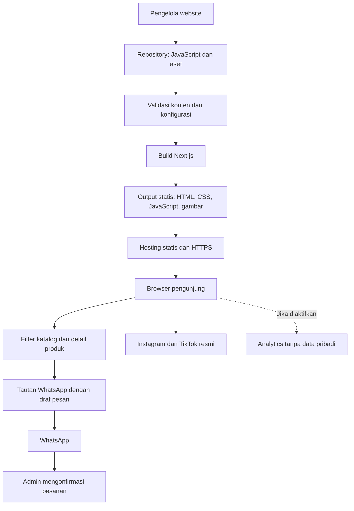
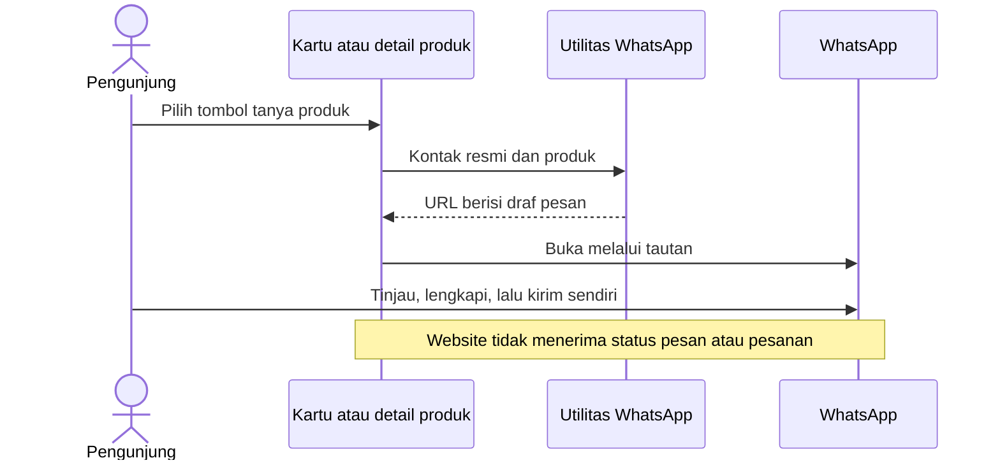

# PRD Struktur Sistem — Decormoment.bdl

Versi: 1.0  
Tanggal: 11 September 2026  
Status: Rancangan teknis; belum diimplementasikan  
Bahasa pemrograman: **JavaScript**, dengan JSX untuk komponen React  
Acuan kebutuhan bisnis: [PRD Produk](</D:/TEGO/LANDING PAGE/PRD.md>)  
Acuan visual: [Style Guide](</D:/TEGO/LANDING PAGE/styleguide.md>)

## 1. Tujuan dan batas sistem

Dokumen ini menerjemahkan PRD produk menjadi struktur teknis yang dapat digunakan developer untuk membangun landing page Decormoment.bdl.

Sistem menampilkan katalog papan ucapan akrilik, harga, detail layanan, konten sosial, dan testimoni. Pengunjung memilih produk lalu membuka WhatsApp dengan draf pesan yang sesuai. Konfirmasi jadwal, desain, total biaya, pembayaran, pengantaran, dan penjemputan dilakukan oleh admin melalui WhatsApp.

**Hasil teknis yang dituju:** satu website responsif, konten utama tersedia pada HTML awal, interaksi katalog berjalan dengan JavaScript, dan data bisnis mudah diperbarui dari satu tempat.

Sistem MVP tidak menyimpan pesanan atau data pelanggan. Tidak ada akun, pembayaran online, pemeriksaan stok otomatis, database, dashboard admin, maupun API transaksi.

### 1.1 Aktor

| Aktor | Aktivitas | Akses sistem |
| --- | --- | --- |
| Pengunjung | Melihat katalog, membuka detail, membaca FAQ, menghubungi bisnis | Halaman publik |
| Admin bisnis | Menjawab pesan dan mengonfirmasi pesanan | WhatsApp bisnis; tidak memerlukan login website |
| Pengelola website/developer | Memperbarui konten dan menerbitkan build | Repository dan layanan hosting |

## 2. Stack yang dipilih

Pilihan berikut merupakan keputusan rancangan untuk MVP. Versi paket dikunci dalam lockfile saat implementasi dan disesuaikan dengan kompatibilitas framework serta Node.js yang dipakai.

| Lapisan | Teknologi | Tanggung jawab |
| --- | --- | --- |
| Bahasa | JavaScript ES Modules | Data, utilitas, validasi, dan logika aplikasi |
| UI | React dengan JSX | Komponen halaman dan interaksi |
| Framework/build | Next.js App Router, static export | Menghasilkan halaman dan aset statis |
| Styling | CSS Modules dan CSS custom properties | Style per komponen serta token warna, jarak, dan tipografi |
| State | React `useState` dan `useRef` | Filter, produk terpilih, galeri, menu, dan fokus dialog |
| Penyimpanan konten | Modul `.js` dalam repository | Katalog, kontak, FAQ, kebijakan, dan konten sosial |
| Gambar | Aset lokal WebP/AVIF dengan fallback | Media produk yang telah dioptimalkan |
| Unit test | Node.js test runner | Aturan harga, validasi data, dan pembentukan tautan |
| Pengujian browser | Playwright | Alur katalog, dialog, navigasi, dan tautan kontak |
| Kualitas kode | ESLint dan formatter | Konsistensi JavaScript, JSX, dan CSS |
| Hosting | Hosting statis/CDN dengan HTTPS | Menyajikan hasil build; penyedia ditentukan kemudian |

Seluruh kode proyek menggunakan `.js`, `.jsx`, atau `.mjs`; tidak memerlukan TypeScript. JSDoc dapat digunakan untuk menjelaskan kontrak data.

Next.js mendukung `output: 'export'` untuk menghasilkan aset statis di direktori `out/`. Node.js digunakan untuk pengembangan dan build; hasilnya disajikan oleh hosting statis. [Dokumentasi static export](https://nextjs.org/docs/app/guides/static-exports).

### 2.1 Catatan keputusan arsitektur

Status keputusan: diusulkan sebagai dasar implementasi PRD ini.

| ID | Kebutuhan dan alternatif | Keputusan dan alasan | Konsekuensi dan pemicu evaluasi ulang |
| --- | --- | --- | --- |
| ADR-01 | HTML awal untuk katalog serta komponen interaktif. Alternatif: HTML/JavaScript murni atau React SPA | Next.js static export; mendukung penyusunan halaman dari data dan komponen React | Tooling lebih besar daripada HTML murni. Tinjau ulang jika pemelihara hanya menguasai HTML/JS dasar |
| ADR-02 | Empat produk dan pembaruan konten sederhana. Alternatif: CMS/database | Modul data JavaScript dalam repository | Pembaruan memerlukan build dan deployment. Tambahkan CMS jika admin membutuhkan edit mandiri secara rutin |
| ADR-03 | Konfirmasi pesanan dilakukan melalui chat. Alternatif: form pesanan dan backend | Tautan WhatsApp dengan draf pesan | Website tidak mengetahui pesan terkirim atau transaksi selesai. Evaluasi backend bila diperlukan pencatatan pesanan terpadu |
| ADR-04 | Interaksi lokal pada satu halaman. Alternatif: global state library | State React lokal pada komponen terkait | Koordinasi lebih sederhana; tinjau global state hanya bila muncul state lintas halaman yang kompleks |
| ADR-05 | Gambar siap tampil pada hosting statis. Alternatif: layanan optimasi saat request | Siapkan beberapa ukuran gambar sebelum deployment, tampilkan melalui `picture`/`img` | Perlu pengolahan aset saat konten berubah; pertimbangkan layanan media jika volume meningkat |

## 3. Arsitektur sistem



### 3.1 Pembagian tanggung jawab

| Lapisan | Tanggung jawab | Batasan |
| --- | --- | --- |
| Konten | Menyimpan nilai asli produk dan kebijakan | Tidak mengandung event handler atau markup halaman |
| Validasi | Memeriksa kelengkapan dan kelayakan publikasi | Tidak mengarang nilai pengganti untuk data bisnis |
| Utilitas | Format rupiah, seleksi harga, filter data, draf pesan | Tidak bergantung pada DOM atau React |
| Komponen | Menampilkan data dan mengelola interaksi | Tidak menulis ulang nomor kontak atau angka harga |
| Integrasi | Membentuk tautan eksternal dan mengirim event analytics opsional | Tidak mengirim pesan WhatsApp atau mengonfirmasi pesanan |
| Build/deployment | Membuat serta menerbitkan satu paket statis | Tidak melakukan perubahan data pesanan saat pengunjung membuka halaman |

### 3.2 Render dan JavaScript browser

- `layout.jsx`, `page.jsx`, dan bagian informatif dirender saat build.
- Katalog interaktif, dialog, menu mobile, dan pencatatan klik ditempatkan pada Client Components yang kecil.
- Hanya komponen yang membutuhkan state, event handler, atau API browser yang diberi `'use client'`.
- Data yang dikirim ke komponen browser harus sudah difilter sebagai konten yang boleh dipublikasikan.
- Akses `window`, `document`, dan `navigator` dilakukan pada event/effect browser, bukan pada evaluasi modul saat build.

Pembagian tersebut mengikuti batas Server dan Client Components Next.js. Pada rancangan ini, bagian server dijalankan ketika build, sehingga tidak menambah server aplikasi pada hosting. [Dokumentasi komponen](https://nextjs.org/docs/app/getting-started/server-and-client-components).

## 4. Struktur folder

Struktur berikut adalah target proyek, bukan daftar file aplikasi yang sudah dibuat.

```text
decormoment-landing/
├── PRD.md
├── PRD-SISTEM.md
├── styleguide.md
├── README.md
├── package.json
├── package-lock.json
├── next.config.mjs
├── jsconfig.json
├── eslint.config.mjs
├── playwright.config.js
├── .env.example
├── .gitignore
├── public/
│   ├── images/
│   │   ├── brand/
│   │   ├── products/
│   │   ├── social/
│   │   └── testimonials/
│   └── fonts/
├── scripts/
│   ├── build.js
│   ├── validate-content.js
│   └── generate-site-files.js
├── src/
│   ├── app/
│   │   ├── layout.jsx
│   │   ├── page.jsx
│   │   ├── not-found.jsx
│   │   └── globals.css
│   ├── components/
│   │   ├── layout/
│   │   │   ├── Header.jsx
│   │   │   ├── MobileMenu.jsx
│   │   │   └── Footer.jsx
│   │   ├── sections/
│   │   │   ├── HeroSection.jsx
│   │   │   ├── ServicesSection.jsx
│   │   │   ├── OrderStepsSection.jsx
│   │   │   ├── SocialSection.jsx
│   │   │   ├── TestimonialsSection.jsx
│   │   │   ├── GuaranteeSection.jsx
│   │   │   ├── FaqSection.jsx
│   │   │   └── ClosingSection.jsx
│   │   ├── catalog/
│   │   │   ├── CatalogSection.jsx
│   │   │   ├── CatalogClient.jsx
│   │   │   ├── ProductFilter.jsx
│   │   │   ├── ProductCard.jsx
│   │   │   ├── ProductDialog.jsx
│   │   │   ├── ProductGallery.jsx
│   │   │   └── ProductPrice.jsx
│   │   └── ui/
│   │       ├── WhatsAppLink.jsx
│   │       ├── FloatingWhatsApp.jsx
│   │       ├── SocialLink.jsx
│   │       └── ResponsiveImage.jsx
│   ├── data/
│   │   ├── site.js
│   │   ├── products.js
│   │   ├── services.js
│   │   ├── policies.js
│   │   ├── faqs.js
│   │   ├── social-posts.js
│   │   └── testimonials.js
│   ├── lib/
│   │   ├── catalog.js
│   │   ├── pricing.js
│   │   ├── whatsapp.js
│   │   ├── analytics.js
│   │   ├── content-validation.js
│   │   └── metadata.js
│   └── styles/
│       └── tokens.css
└── tests/
    ├── unit/
    │   ├── pricing.test.js
    │   ├── whatsapp.test.js
    │   └── content-validation.test.js
    └── e2e/
        ├── catalog.spec.js
        └── contact-and-navigation.spec.js
```

CSS Modules ditempatkan di samping komponen yang memakainya, misalnya `ProductCard.module.css`. Tidak semua komponen harus memiliki stylesheet terpisah jika style bersama sudah mencukupi.

`scripts/build.js` menjadi pintu masuk build: memilih mode, menjalankan validasi, menghasilkan file situs, lalu menjalankan build framework. `generate-site-files.js` menghasilkan `robots.txt` dan `sitemap.xml` sesuai mode dan domain. Direktori `out/` dan `.next/` merupakan hasil build, bukan sumber konten.

## 5. Struktur data JavaScript

### 5.1 Konfigurasi bisnis — `site.js`

Contoh kontrak awal; `null` menandakan data belum diberikan, bukan nilai yang boleh diganti dengan tebakan.

```javascript
export const site = {
  brandName: 'Decormoment.bdl',
  locale: 'id-ID',
  currency: 'IDR',
  timeZone: 'Asia/Jakarta',
  serviceArea: 'Bandar Lampung dan sekitarnya',
  canonicalUrl: null,
  whatsapp: { number: null, verified: false },
  instagram: { url: null, verified: false },
  tiktok: { url: null, verified: false },
  logo: null,
  heroImage: null,
  analytics: { enabled: false, provider: null, publicId: null },
};
```

Nomor WhatsApp disimpan sebagai string digit dengan kode negara, tanpa `+`, spasi, atau tanda hubung. Tautan sosial disimpan sebagai URL lengkap setelah akun resminya diverifikasi. Konfigurasi ini adalah data publik; tidak boleh berisi token rahasia.

### 5.2 Produk — `products.js`

```javascript
export const products = [
  {
    id: 'oval-thumbelina',
    name: 'Oval Thumbelina',
    shape: 'oval',
    description: null,
    images: [],
    specifications: {
      dimensions: null,
      material: null,
      colors: [],
    },
    price: {
      amount: 80000,
      compareAt: 120000,
      currency: 'IDR',
      basis: null,
      verified: false,
      comparisonVerified: false,
      validUntil: null,
    },
    usage: { model: null, duration: null },
    inclusions: [],
    additionalCostNote: null,
    customAvailable: true,
    published: false,
    sortOrder: 1,
  },
];
```

Objek di atas adalah contoh struktur satu produk. Implementasi mengisi empat produk dengan nilai awal berikut:

| ID | Nama | `shape` | `price.amount` | `price.compareAt` |
| --- | --- | --- | --- | --- |
| `oval-thumbelina` | Oval Thumbelina | `oval` | 80000 | 120000 |
| `oval-pinkish` | Oval Pinkish | `oval` | 80000 | 120000 |
| `kubah-serenity-blue` | Kubah Serenity Blue | `kubah` | 45000 | 65000 |
| `kubah-pinkish-bloom` | Kubah Pinkish Bloom | `kubah` | 45000 | 65000 |

Aturan kontrak:

- `id` unik dan stabil; nama produk boleh diperbaiki tanpa mengganti ID.
- `shape` hanya `oval` atau `kubah` untuk MVP.
- Harga merupakan integer rupiah, bukan string berformat `Rp`.
- `compareAt` opsional; bila ditampilkan harus lebih besar dari harga aktif dan `comparisonVerified` bernilai `true`.
- `basis` menjelaskan satuan harga yang dikonfirmasi klien. `usage.model` dan `usage.duration` menjelaskan mekanisme serta durasi pemakaian.
- `validUntil` opsional, dalam format ISO 8601 dengan zona waktu eksplisit. Nilai kosong bukan klaim bahwa promo berlaku selamanya.
- `images` berisi `{ src, alt, width, height, variants }`; setiap variant memuat `{ src, width }` untuk sumber gambar responsif.
- Produk publik membutuhkan foto asli, deskripsi faktual, harga terverifikasi, dan ketentuan layanan yang memadai sesuai PRD produk.
- Spesifikasi yang masih `null` tidak ditampilkan sebagai fakta. Field spesifikasi opsional tidak boleh diisi secara acak agar validasi lolos.

### 5.3 Kebijakan dan konten lain

| Modul | Struktur minimum | Aturan penggunaan |
| --- | --- | --- |
| `policies.js` | Aturan custom, revisi, pesanan mendadak, ongkir, penjemputan, garansi; masing-masing memiliki `id`, `summary`, `details`, `verified` | Menjadi sumber aturan layanan; bagian keunggulan dan FAQ merujuk aturan yang sama |
| `services.js` | `id`, `title`, `policyId`, `iconKey` | Mengatur penyajian manfaat tanpa menggandakan ketentuan layanan |
| `faqs.js` | `id`, `question`, `policyId`, `order` | Jawaban diambil dari kebijakan terkait; perbedaan kalimat tidak boleh mengubah makna |
| `social-posts.js` | `id`, `platform`, `url`, `thumbnail`, `caption`, `approved`, `order` | Hanya konten resmi dan disetujui yang ditampilkan |
| `testimonials.js` | `id`, `displayName`, `quote`, `image`, `approved`, `order` | Minimal kutipan atau gambar asli; nama yang ditampilkan sudah diizinkan |

Informasi izin internal dan data pribadi mentah tidak disimpan dalam payload browser. `approved` adalah penanda konten sudah layak publikasi, bukan tempat menyimpan bukti izin atau identitas pelanggan.

### 5.4 Harga sebagai satu sumber kebenaran

- `pricing.js` menyediakan `formatRupiah(amount)` dan seleksi harga tampilan.
- Hero menghitung harga termurah dari produk yang boleh ditampilkan menggunakan data yang sama dengan kartu dan dialog.
- Harga tidak ditulis manual di komponen, tombol, metadata, atau gambar promosi website.
- Produk tanpa harga valid tidak dianggap bernilai nol.
- Jika tidak ada harga publik yang valid, jangan menampilkan “mulai Rp0”; build publik MVP harus gagal karena katalog belum siap.
- Masa promo tidak berubah otomatis hanya karena data memiliki `validUntil`. Pada hosting statis, pengelola harus memperbarui harga dan menerbitkan build sebelum batas tersebut. Build publik menolak harga yang sudah kedaluwarsa.
- Bila promo harus berganti tanpa tindakan pengelola, penjadwalan build beserta pemantauan kegagalannya menjadi kebutuhan tambahan di luar MVP.

## 6. Struktur halaman dan kontrak komponen

### 6.1 Rute dan navigasi

| Alamat | Fungsi |
| --- | --- |
| `/` | Landing page utama |
| `/#katalog` | Menuju katalog |
| `/#layanan` | Menuju fasilitas dan ketentuan singkat |
| `/#cara-pesan` | Menuju alur pemesanan |
| `/#cerita` | Menuju konten sosial, hanya jika bagian tersedia |
| `/#ulasan` | Menuju testimoni, hanya jika bagian tersedia |
| `/#faq` | Menuju FAQ |
| `/#kontak` | Menuju ajakan pemesanan dan kontak |
| URL tidak dikenal | Halaman 404 dengan tautan kembali |

Detail produk menggunakan dialog pada halaman yang sama. MVP tidak membuat route detail terpisah. Menu tidak boleh mengarah ke bagian yang disembunyikan.

### 6.2 Susunan komponen

```text
RootLayout
├── Header + MobileMenu
├── Main
│   ├── HeroSection
│   ├── CatalogSection
│   │   └── CatalogClient
│   │       ├── ProductFilter
│   │       ├── ProductCard[] + ProductPrice + WhatsAppLink
│   │       └── ProductDialog
│   │           ├── ProductGallery
│   │           ├── ProductPrice
│   │           └── WhatsAppLink
│   ├── ServicesSection
│   ├── OrderStepsSection
│   ├── SocialSection, jika konten tersedia
│   ├── TestimonialsSection, jika konten tersedia
│   ├── GuaranteeSection
│   ├── FaqSection
│   └── ClosingSection
├── Footer
└── FloatingWhatsApp
```

| Komponen | Input utama | Perilaku |
| --- | --- | --- |
| `CatalogSection` | Data produk yang lolos seleksi publikasi | Menyiapkan katalog untuk render awal |
| `CatalogClient` | `products`, kontak terverifikasi | Memiliki state filter dan produk terpilih |
| `ProductFilter` | `value`, `onChange` | Semua, Oval, Kubah; status pilihan terlihat dan terbaca pembaca layar |
| `ProductCard` | `product`, `onOpen`, `contact` | Menampilkan ringkasan serta tautan chat yang tetap tersedia pada HTML awal |
| `ProductDialog` | `product`, `onClose` | Detail, Escape, pengelolaan fokus, dan penguncian scroll latar |
| `ProductGallery` | `images` | Pilihan foto dan pembesaran dalam dialog yang sama |
| `ProductPrice` | `price` | Menampilkan harga aktif dan pembanding yang valid |
| `WhatsAppLink` | `contact`, `product` opsional, `placement` | Tautan standar dengan draf pesan; pencatatan klik opsional |
| `SocialSection` | Post yang disetujui | Thumbnail dan tautan konten, tanpa memuat embed berat saat halaman dibuka |
| `FaqSection` | Pertanyaan dan kebijakan terkait | Accordion berbasis `details`/`summary`, tetap bisa digunakan tanpa JavaScript |

## 7. State dan alur interaksi

### 7.1 State lokal

| State | Nilai awal | Pemilik dan perubahan |
| --- | --- | --- |
| `selectedShape` | `'all'` | `CatalogClient`; berubah saat memilih filter |
| `selectedProductId` | `null` | `CatalogClient`; diisi saat membuka detail dan direset saat menutup |
| `activeImageIndex` | `0` | `ProductGallery`; direset ketika produk berubah |
| `isMobileMenuOpen` | `false` | `MobileMenu`; ditutup setelah navigasi atau Escape |
| Referensi pemicu dialog | `null` | `useRef`; mengembalikan fokus ke tombol pembuka |

Produk terpilih diturunkan dari `selectedProductId`, bukan disalin sebagai objek state kedua. Daftar hasil filter diturunkan dari produk dan `selectedShape`. Tidak diperlukan localStorage atau state global untuk MVP.

### 7.2 Interaksi katalog

1. Render awal menampilkan seluruh produk yang tersedia untuk mode saat itu.
2. Pengguna memilih bentuk; daftar berubah dan pilihan filter ditandai.
3. Pengguna membuka detail; sistem mencocokkan ID dengan katalog aktif.
4. Jika ID tidak valid, dialog tidak dibuka dan aplikasi tetap dapat digunakan.
5. Dialog menampilkan produk tersebut; fokus berpindah ke dalam dialog dan tidak keluar ke latar.
6. Menutup dialog memulihkan scroll serta fokus pengguna.
7. Filter tetap sama setelah dialog ditutup. Galeri tidak membawa indeks foto dari produk sebelumnya.

Gunakan satu dialog; pembesaran foto tidak menambahkan modal bertumpuk.

### 7.3 Alur WhatsApp



Kontrak utilitas yang diusulkan:

```javascript
export function createWhatsAppUrl(contact, message) {
  const number = contact?.number;
  const validFormat = typeof number === 'string'
    && /^[1-9]\d{7,14}$/.test(number)
    && number.startsWith('62');

  if (!contact?.verified || !validFormat) return null;
  if (typeof message !== 'string' || !message.trim()) return null;

  return `https://wa.me/${number}?text=${encodeURIComponent(message)}`;
}
```

Pemeriksaan format tidak membuktikan kepemilikan atau keaktifan nomor; verifikasi tetap dilakukan dengan bisnis. Pesan produk mengikuti template pada PRD produk dan menyertakan nama model, tanpa menyatakan stok atau harga akhir sudah dikonfirmasi.

Tombol menggunakan elemen tautan dengan `href` yang valid, bukan bergantung pada `window.open` setelah proses async. Jika dibuka di tab baru, gunakan `rel="noopener noreferrer"`. Analytics tidak boleh menghalangi navigasi.

## 8. Integrasi dan kondisi kegagalan

### 8.1 Batas integrasi

| Integrasi | Mekanisme | Yang tidak dilakukan |
| --- | --- | --- |
| WhatsApp | Tautan dengan nomor resmi dan pesan ter-encode | Pengiriman otomatis, pembacaan chat, sinkronisasi status |
| Instagram | Tautan profil atau post resmi | Mengambil feed memakai token di browser |
| TikTok | Tautan profil atau video resmi | Autoplay video atau scraping konten |
| Analytics opsional | Adapter `track(event, params)` | Menyimpan isi ucapan atau menganggap klik sebagai order |

Tidak diperlukan endpoint aplikasi seperti `POST /orders`, `GET /availability`, atau API pembayaran pada MVP. File HTML, JavaScript, CSS, dan media disajikan langsung oleh hosting.

### 8.2 Penanganan kondisi kosong atau gagal

| Kondisi | Perilaku yang diwajibkan |
| --- | --- |
| WhatsApp belum ada/tidak valid | Pada draf, CTA kontak dinonaktifkan dengan keterangan data belum tersedia. Build publik gagal |
| URL sosial belum diverifikasi | Tidak membuat tautan palsu; draf menyembunyikan tombol. Kedua akun resmi diperlukan untuk memenuhi scope peluncuran awal |
| Video/testimoni belum ada | Sembunyikan seluruh bagian dan tautan navigasinya |
| Gambar gagal diunduh | Tampilkan fallback berlabel; nama, harga, dan tombol chat tetap terbaca |
| Filter menghasilkan daftar kosong | Tampilkan keterangan serta tindakan kembali ke Semua |
| JavaScript belum aktif/gagal | HTML awal tetap menampilkan katalog, harga, FAQ, dan tautan chat; filter dan dialog memerlukan JavaScript |
| Analytics diblokir/gagal | Alur katalog dan WhatsApp tetap berjalan |
| WhatsApp meminta login/instalasi | Pengguna mengikuti alur layanan tersebut; website tidak menyatakan pesan sudah terkirim |

## 9. Validasi dan pengelolaan konten

### 9.1 Mode draf dan publik

| Mode | Kegunaan | Aturan |
| --- | --- | --- |
| `draft` | Desain dan review | Boleh menggunakan data belum lengkap dengan penanda jelas, metadata `noindex`, analytics mati, kontak kosong tidak aktif |
| `public` | Kandidat peluncuran | Memerlukan kontak resmi, domain, empat produk siap tayang, gambar asli, harga aktif, dan kebijakan terverifikasi |

Mode dipilih saat build melalui `SITE_MODE`; nilai bawaan adalah `draft`, dan nilai lain ditolak. Ini merupakan variabel build, bukan pengaturan yang dapat diganti pengunjung. Preview dipisahkan dari domain publik; `noindex` bukan mekanisme kerahasiaan.

### 9.2 Aturan validasi sebelum build publik

1. ID produk unik, bentuk valid, urutan dapat ditentukan, dan seluruh harga berupa integer positif.
2. Empat produk MVP ditandai `published` dan memenuhi syarat data serta media.
3. Harga penawaran terverifikasi; perbandingan yang belum terverifikasi tidak dirender.
4. Jika `validUntil` diisi, format dan waktunya valid serta belum lewat pada waktu build.
5. Nomor WhatsApp dan kedua URL sosial memenuhi format serta sudah diverifikasi oleh bisnis.
6. URL sosial menggunakan HTTPS pada domain platform yang diizinkan; protokol atau host lain ditolak.
7. Semua referensi kebijakan, file media, dan ukuran gambar valid. Gambar informatif memiliki alt text.
8. Mekanisme pemakaian, dasar harga, cakupan ongkir, penjemputan, dan garansi telah dikonfirmasi sesuai PRD produk.
9. Domain canonical merupakan URL HTTPS yang benar dan tidak berisi placeholder.
10. Konten testimoni/video yang tidak disetujui tidak masuk payload halaman maupun aset deployment. Jika belum ada konten yang siap, bagian dihilangkan.

Validasi yang gagal mengeluarkan pesan dengan lokasi field, misalnya `products[oval-thumbelina].price.basis belum diisi`. Jangan membocorkan informasi pribadi pada log.

### 9.3 Alur pembaruan

Pengelola mengubah modul data/aset → menjalankan validasi dan build draf → memeriksa preview → memperbaiki temuan → membuat build publik → menerbitkan hasil → memeriksa halaman yang sudah tayang.

Seluruh pembaruan harga dan ketentuan layanan perlu build ulang. Mengedit file sumber tanpa deployment tidak mengubah website yang sedang tayang.

## 10. SEO, performa, aksesibilitas, dan privasi

### 10.1 SEO

- HTML menggunakan `lang="id"`, satu H1, heading berurutan, serta nama dan harga produk yang tersedia sejak render awal.
- Metadata didefinisikan pada layout/page: judul, deskripsi, canonical, dan Open Graph dari identitas resmi.
- Metadata tidak perlu memuat angka promo agar tidak mudah tertinggal ketika harga berubah.
- `robots.txt` dan sitemap dihasilkan sebagai file statis; sitemap publik berisi URL halaman utama pada domain yang benar.
- Jangan membuat rating atau structured data bisnis dari nilai asumsi.

Next.js menyediakan metadata dan konvensi gambar Open Graph untuk menghasilkan tag halaman. Rancangan menggunakan metadata statis yang sesuai dengan konten build. [Dokumentasi metadata](https://nextjs.org/docs/app/getting-started/metadata-and-og-images).

### 10.2 Performa

- Sajikan gambar responsif; tetapkan lebar, tinggi, dan rasio agar layout tidak melompat.
- Prioritaskan satu gambar hero; gambar di bawahnya menggunakan lazy loading.
- Gunakan font lokal berlisensi dengan jumlah varian terbatas.
- Gunakan CSS untuk transisi sederhana; animasi nonesensial dinonaktifkan pada `prefers-reduced-motion`.
- Video awal berupa thumbnail yang mengarah ke konten asli; embed dapat ditambahkan kemudian bila diperlukan.
- Target proyek: Lighthouse mobile Performance dan Accessibility masing-masing minimal 90 pada build publik, tanpa menjanjikan skor sebelum pengujian.
- Catat ukuran transfer gambar dan JavaScript, kondisi simulasi, serta penyebab perlambatan jika target belum terpenuhi.

### 10.3 Aksesibilitas

- Navigasi keyboard lengkap, skip link, dan indikator fokus yang terlihat.
- Dialog mempunyai nama yang dapat diakses, dukungan Escape, fokus terkendali, dan pengembalian fokus.
- Foto yang diperbesar tidak membuat kontrol tutup sulit dijangkau di HP.
- Kontras teks normal minimal 4,5:1 dan area sentuh minimal 44 × 44 piksel.
- Tombol WhatsApp mengambang tidak menutup konten, serta disembunyikan atau tidak dapat difokuskan ketika dialog terbuka.
- Harga coret dibarengi label harga pembanding yang dapat dipahami pembaca layar.

### 10.4 Privasi dan keamanan dasar

- Semua aset dalam `public/` dianggap dapat diakses publik, termasuk file yang tidak ditampilkan di UI. Hanya aset siap publik yang masuk output.
- Render konten sebagai teks React; hindari HTML mentah dari sumber konten.
- Token, kredensial, dan data pelanggan tidak ditempatkan pada modul frontend atau variabel publik.
- Tidak ada penyimpanan nama, tanggal acara, nomor pelanggan, atau isi ucapan pada database/localStorage situs.
- Sanitasi screenshot testimoni sebelum dimasukkan sebagai aset.
- Konfigurasi HTTPS dan header hosting mengikuti penyedia yang dipilih. Jangan mengandalkan konfigurasi server Next.js untuk output statis.

## 11. Analytics opsional

Kontrak adapter: `track(eventName, parameters)`. Saat analytics belum dikonfigurasi, fungsi menjadi no-op. Pemilihan provider ditunda sampai kebutuhan pengukuran dan akun bisnis tersedia.

| Event | Pemicu | Parameter yang diperbolehkan |
| --- | --- | --- |
| `view_item` | Dialog berhasil dibuka | `product_id` |
| `filter_catalog` | Pengguna mengganti filter | `shape` |
| `click_whatsapp` | Klik tautan WhatsApp | `placement`, `product_id` jika relevan |
| `click_instagram` | Klik profil/post Instagram | `placement`, `post_id` jika relevan |
| `click_tiktok` | Klik profil/video TikTok | `placement`, `post_id` jika relevan |
| `faq_expand` | Pertanyaan dibuka | `faq_id` |

`placement` menggunakan nilai konsisten: `header`, `hero`, `catalog`, `product_dialog`, `closing`, `footer`, atau `floating`. Jangan mengirim URL WhatsApp lengkap karena berisi teks pesan. Pencatatan menggunakan interaksi nyata, tidak dipicu ulang hanya karena komponen melakukan render ulang.

Jika provider menyediakan sesi, rasio klik WhatsApp dihitung berdasarkan sesi dengan minimal satu klik dibagi total sesi. Hasil transaksi tetap memerlukan catatan admin terpisah.

## 12. Pengujian dan kriteria penerimaan teknis

Pengujian dipusatkan pada aturan bisnis dan alur yang berisiko salah, tanpa mewajibkan snapshot untuk setiap komponen presentasi.

| Area | Skenario yang harus lulus |
| --- | --- |
| Harga | Empat harga sesuai data; nilai nol/negatif/NaN ditolak; harga pembanding tidak valid disembunyikan; harga hero konsisten |
| Promo | Harga kedaluwarsa menolak build publik; batas waktu dengan zona berbeda dibandingkan dengan benar |
| WhatsApp | Nomor kosong/tidak terverifikasi tidak menghasilkan URL; nama produk benar; spasi, baris baru, `&`, `#`, dan emoji tidak merusak pesan |
| Publikasi | Konten tidak disetujui tidak masuk output publik; data wajib kosong menggagalkan build publik; draf masih dapat ditinjau |
| Katalog | Semua/Oval/Kubah benar; detail menampilkan produk terpilih; filter tetap setelah dialog ditutup |
| Dialog | Escape, tombol tutup, fokus awal/akhir, pergantian galeri, dan scroll latar bekerja |
| Kontak/sosial | Tujuan tautan benar dan tidak ada tombol mati; analytics gagal tidak menghentikan navigasi |
| HTML awal | Nama produk, harga, FAQ, dan tautan chat dapat ditemukan tanpa menjalankan JavaScript |
| Responsif | Tidak ada scroll horizontal pada lebar 360, 390, 768, 1280, dan 1440 piksel |
| Deployment | Halaman utama, aset, metadata, robots, sitemap, dan 404 disajikan dengan benar |

Unit test menggunakan [test runner Node.js](https://nodejs.org/api/test.html). Pengujian browser menggunakan [Playwright](https://playwright.dev/docs/intro) pada output statis. Tes memeriksa URL WhatsApp tanpa mengirim pesan atau menghubungi pelanggan sungguhan.

Emulasi browser dilengkapi pemeriksaan perangkat nyata bila tersedia. Bila Safari iOS atau perangkat tertentu belum diperiksa, keterbatasannya dicatat dan tidak diklaim telah lulus.

## 13. Build, deployment, dan pemeliharaan

### 13.1 Konfigurasi build inti

```javascript
// next.config.mjs
const nextConfig = {
  output: 'export',
  trailingSlash: true,
};

export default nextConfig;
```

Rancangan memakai gambar yang sudah dioptimalkan dengan elemen `picture`/`img`. Optimasi gambar bawaan yang memerlukan layanan server, Server Actions, ISR, serta fitur berbasis request tidak digunakan dalam static export. [Batas static export](https://nextjs.org/docs/app/guides/static-exports#unsupported-features).

### 13.2 Perintah pengembangan yang harus disediakan

| Perintah | Kontrak |
| --- | --- |
| `npm run dev` | Pengembangan lokal dalam mode draf |
| `npm run lint` | Pemeriksaan JavaScript/JSX |
| `npm run test:unit` | Pengujian aturan data dan tautan |
| `npm run build:preview` | Validasi draf, file situs draf, dan build dengan `SITE_MODE=draft` |
| `npm run build` | Validasi ketat serta build dengan `SITE_MODE=public`; gagal jika data peluncuran belum siap |
| `npm run preview` | Menyajikan direktori `out/` melalui server statis lokal |
| `npm run test:e2e` | Menguji build statis yang telah disiapkan |

Perintah tersebut adalah persyaratan script yang akan dibuat. Gunakan script Node.js untuk pengaturan environment agar berjalan pada Windows dan sistem lain. `npm run preview` tidak menggunakan `next start`.

### 13.3 Pipeline rilis

1. Instal dependensi dari lockfile menggunakan `npm ci` pada Node.js yang sudah ditetapkan proyek.
2. Jalankan lint dan unit test.
3. Jalankan build publik yang memvalidasi konten dan konfigurasi.
4. Jalankan E2E terhadap hasil statis; jangan mengirim pesan eksternal.
5. Periksa aset, metadata, aksesibilitas, dan performa pada preview hasil build.
6. Terbitkan satu paket output secara atomik pada hosting yang dipilih.
7. Periksa URL publik dan simpan identitas versi build untuk rollback.

Hosting harus menyajikan 404 yang benar, bukan mengembalikan homepage berstatus 200 untuk semua URL. Aset bernama hash dapat di-cache lama; HTML dan konten yang berubah harus diperbarui atau divalidasi ulang sesuai konfigurasi hosting.

Rollback menggunakan paket deployment sebelumnya. Sebelum rollback, periksa apakah harga dan penawaran pada paket lama masih berlaku agar rollback tidak menghidupkan promo kedaluwarsa.

### 13.4 Hasil yang wajib diserahkan pada implementasi

- Source JavaScript/JSX, modul data, style, dan aset siap publik.
- Lockfile serta petunjuk versi Node.js dan perintah lokal.
- README cara mengganti harga, foto, nomor WhatsApp, URL sosial, dan kebijakan.
- Hasil pengujian beserta perangkat/browser yang diperiksa dan keterbatasannya.
- Build statis siap deploy, pengaturan domain/hosting setelah ditentukan, dan prosedur rollback.

## 14. Pengembangan berikutnya dan ketergantungan

| Kebutuhan baru | Perubahan struktur yang perlu dipertimbangkan |
| --- | --- |
| Admin ingin mengubah katalog sendiri | CMS, autentikasi pengelola, dan proses preview/publikasi |
| Ketersediaan tanggal secara real-time | Database jadwal, backend, dan aturan reservasi |
| Pencatatan order dan pembayaran | Model order, API transaksi, validasi server, serta integrasi pembayaran |
| Halaman detail produk untuk pencarian | Route statis per produk dan metadata khusus |
| Pergantian promo otomatis | Scheduler build atau sumber harga dinamis dengan penanganan kegagalan |

Perubahan ini tidak diperlukan untuk meluncurkan MVP saat ini. Data yang masih ditunggu mengikuti PRD produk: kontak resmi, foto asli, spesifikasi, mekanisme pemakaian, validitas harga, dan ketentuan operasional.

**Definisi selesai tahap dokumen:** arsitektur JavaScript, struktur folder, kontrak data, komponen, alur integrasi, pengujian, dan deployment telah ditetapkan sebagai acuan implementasi. Dokumen ini belum merupakan aplikasi yang berjalan dan belum menerbitkan website.
