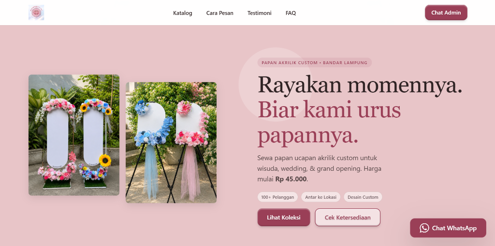

<div align="center">
  
  <br />
  <br />
  <h1>Decormoment.bdl</h1>
  <p><strong>Platform Landing Page Premium untuk Bisnis Papan Ucapan Akrilik</strong></p>
  
  [](https://nextjs.org/)
  [](https://reactjs.org/)
  [](https://github.com/css-modules/css-modules)
  []()
</div>

<br />

Website landing page ultra-cepat yang dirancang khusus untuk bisnis persewaan papan ucapan akrilik custom di Bandar Lampung. Menggabungkan estetika desain premium (glassmorphism, animasi yang halus, palet warna elegan) dengan performa tertinggi dari ekosistem **Next.js App Router** berbasis Static Site Generation (SSG).

## Fitur Utama

- **Ultra Fast & Static:** Di-build murni sebagai HTML statis (`output: 'export'`), memastikan loading website instan tanpa jeda server-response.
- **Mobile-First UI/UX:** Tata letak disesuaikan 100% untuk kenyamanan pengguna smartphone, mulai dari jarak spasi (padding/gap), ukuran font (fluid typography), hingga rasio galeri produk.
- **Coverflow Carousel:** Interaksi geser (swipe) produk berbasis CSS 3D dan requestAnimationFrame yang ringan dan mulus, tanpa ketergantungan library besar (zero-dependency carousel).
- **WhatsApp Seamless Integration:** Seluruh alur pemesanan diarahkan (konversi) langsung ke WhatsApp Admin dengan pesan pre-filled dinamis sesuai nama dan harga produk yang diklik.
- **SEO Dominance:** Struktur Semantic HTML5 lengkap dengan OpenGraph, Twitter Cards, Canonical Links, dan optimasi lokal untuk kata kunci pencarian.

## Stack Teknologi

- **Framework:** [Next.js 14](https://nextjs.org/) (App Router)
- **Library:** [React 18](https://reactjs.org/)
- **Styling:** Vanilla CSS Modules dengan sistem Design Tokens (`tokens.css`)
- **Ikonography:** [Lucide React](https://lucide.dev/)
- **Scroll Halus:** [Lenis](https://lenis.studiofreight.com/)

---

## Panduan Menjalankan di Lokal (Developer)

Pastikan Anda memiliki [Node.js](https://nodejs.org/) (versi 18.x atau 20.x) terinstal di sistem Anda.

### 1. Instalasi
```bash
git clone https://github.com/tegokkk/DECORMOMENT.BDL.git
cd DECORMOMENT.BDL
npm install
```

### 2. Mode Pengembangan (Development)
```bash
npm run dev
```
Buka [http://localhost:3000](http://localhost:3000) pada browser Anda. File akan otomatis ter-update saat Anda melakukan perubahan kode.

### 3. Build & Pratinjau (Production)
Karena website ini dikonfigurasi sebagai Static Export, jalankan perintah berikut untuk meng-generate file statisnya:
```bash
npm run build
```
File hasil build akan masuk ke dalam folder `out/`. Anda bisa meninjaunya dengan perintah:
```bash
npm run preview
```

## Struktur Konten (Cara Memperbarui Data)

Jika Anda ingin mengubah isi website tanpa harus menyentuh kode desain, Anda cukup memodifikasi file di dalam folder `src/data/`:

| File Data | Kegunaan |
| ------ | ------ |
| `src/data/site.js` | Mengatur nomor WhatsApp admin, tautan Instagram, TikTok, dan URL domain utama. |
| `src/data/products.js` | Menambah/menghapus/mengedit katalog model papan (nama, harga diskon, foto, kategori). |
| `src/data/services.js` | Mengedit poin-poin keuntungan atau "Kenapa Memilih Kami". |
| `src/data/faqs.js` | Menambah atau mengubah daftar Tanya Jawab (FAQ). |
| `src/data/testimonials.js` | Memperbarui ulasan dan rating dari pelanggan. |
| `src/data/policies.js` | Mengubah Syarat & Ketentuan (S&K) penyewaan. |

**Untuk Mengganti Warna/Tema Utama:**
Buka file `src/styles/tokens.css` dan ubah nilai Hex pada bagian `--color-primary`, `--color-petal`, dll.

## Panduan Deployment (Vercel)

Website ini sangat direkomendasikan untuk di-hosting di [Vercel](https://vercel.com/) (Gratis selamanya).
1. Login ke Vercel dengan akun GitHub Anda.
2. Klik **Add New...** > **Project**.
3. Import repositori `tegokkk/DECORMOMENT.BDL`.
4. Biarkan konfigurasi bawaan (Vercel otomatis mengenali Next.js).
5. Klik **Deploy** dan website akan online dalam hitungan menit!

---
<div align="center">
  <small>Dibuat untuk Decormoment.bdl</small>
</div>
